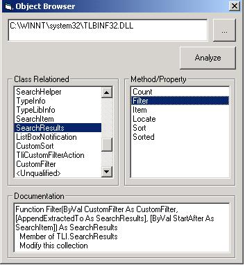



## How Know the property and method belong a DLL using Type Library\. Useful to simulate Object Brower

### Description

With this program, you can see the property and method with yours parameters from a Class.

It is useful to identify faster the method with parameters when the InterDev not give. Also, you can see faster any DLL to use in your program
 
### More Info
 
DLL Path

Property and Method with Parameter

             |
---                |---
**Submitted On**   |2001-12-27 16:23:30
**By**             |[Omar Vivas](https://github.com/Planet-Source-Code/PSCIndex/blob/master/ByAuthor/omar-vivas.md)
**Level**          |Intermediate
**User Rating**    |4.3 (30 globes from 7 users)
**Compatibility**  |VB 4\.0 \(32\-bit\), VB 5\.0, VB 6\.0
**Category**       |[Windows API Call/ Explanation](https://github.com/Planet-Source-Code/PSCIndex/blob/master/ByCategory/windows-api-call-explanation__1-39.md)
**World**          |[Visual Basic](https://github.com/Planet-Source-Code/PSCIndex/blob/master/ByWorld/visual-basic.md)
**Archive File**   |[How\_Know\_t46995172002\.zip](https://github.com/Planet-Source-Code/omar-vivas-how-know-the-property-and-method-belong-a-dll-using-type-library-useful-to-simu__1-30523/archive/master.zip)

